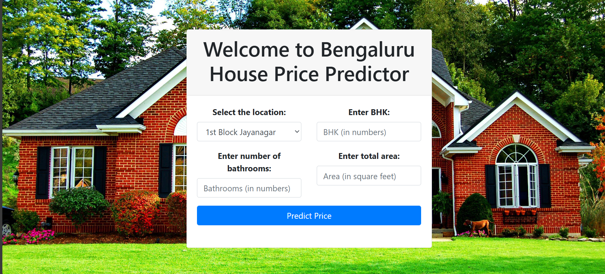
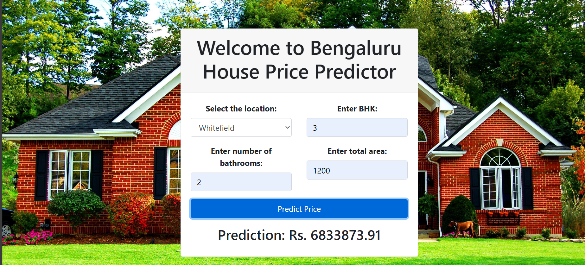

<html>
  <body>
    <h1><b>Bengaluru House Price Prediction</b></h1>
    

      This is a data analysis project aimming to clean the raw data taken from "kaggle.com" and develop a model based on the clean dataset to predict house prices in the city of Bengaluru. The unwanted attributes are removed from the dataset and using the four main attributes namely 'location','bath','bhk' and 'total_sqft', the price is determined by the created model. 

  <b>Dataset used:</b> https://www.kaggle.com/datasets/amitabhajoy/bengaluru-house-price-data

  <b>Overview:</b>
  
  
  
  

  </body>
</html>
 
